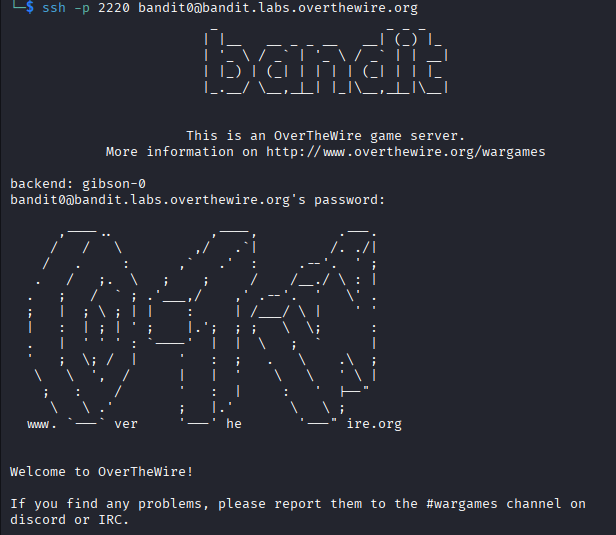
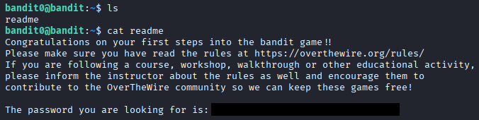

## Bandit - [Level 0](https://overthewire.org/wargames/bandit/bandit0.html) (and 0 -> 1)

# ! ! SPOILERS AHEAD ! !


<br>


#### Level 0 Goal:

> The goal of this level is for you to log into the game using SSH. The host to which you need to connect is bandit.labs.overthewire.org, on port 2220. The username is bandit0 and the password is bandit0. Once logged in, go to the Level 1 page to find out how to beat Level 1.
___


<br>


#### Step 1:

SSH into bandit.labs.overthewire.org:2220 👍

``` ssh -p 2220 bandit0@bandit.labs.overthewire.org ```

then: authenticate with the provided credentials from OTW 

<div align="center">

<!-- writeup screenshot #1 -->  


###### Level 0, #complete

<br>
<!-- for fun img #1 -->

<br>

<div align="left">


## Bandit - [Level 1](https://overthewire.org/wargames/bandit/bandit1.html)

#### Level 1 Goal:

> The password for the next level is stored in a file called readme located in the home directory. Use this password to log into bandit1 using SSH. Whenever you find a password for a level, use SSH (on port 2220) to log into that level and continue the game.
___

##### continued from Level 0
#### Step 2:

hmm... now that I have access, I wonder what's here.
let's try the a command that lists file and directories in the current dir :)
<br>

```ls```
###### readme


<br>


Oh look, a readme file. What could be in here?
let's try a command that can display the contents of a file

``` cat readme ```

###### Congratulations on your first steps into the bandit game!! Please make sure you have read the rules at https://overthewire.org/rules/ If you are following a course, workshop, walkthrough or other educational activity, please inform the instructor about the rules as well and encourage them to contribute to the OverTheWire community so we can keep these games free!

###### The password you are looking for is: [[redacted]](https://youtu.be/dQw4w9WgXcQ)


<br><br>

<!-- writeup screenshot #2 -->
<div align="center">


<br><br>


<!-- cool cat!! (for fun img #2) -->

<div align="center">
</img>

<!--
 _________
/ Thanks  \
\  WCSC!  /
 ---------
        \   ^__^
         \  (oo)\_______
            (__)\       )\/\
                ||----w |
                ||     ||
   __        ______ ____   ____
   \ \      / / ___/ ___| / ___|
    \ \ /\ / / |   \___ \| |
     \ V  V /| |___ ___) | |___
      \_/\_/  \____|____/ \____|
-->
